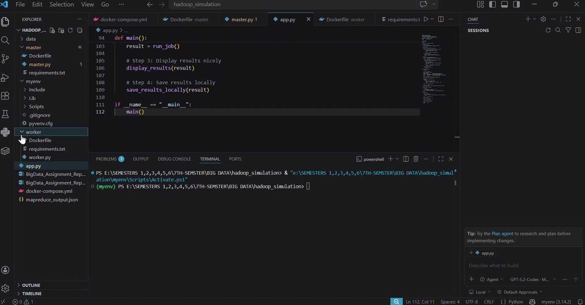
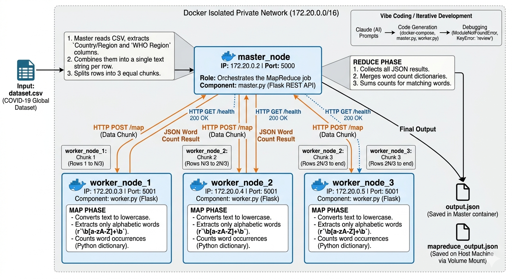

# 🐘 Hadoop-Like Distributed System Simulation

> Big Data Assignment — 7th Semester  
> Simulates a Hadoop cluster using Docker containers, Python Flask, and MapReduce



---

## 📌 Overview

This project simulates a **Hadoop-like distributed computing system** using Docker containers and IP-based HTTP communication. It implements the **MapReduce programming model** where:

- A **Master node** reads a CSV dataset, splits it into chunks, and distributes them to workers
- **Worker nodes** process their chunk in parallel (MAP phase — word count)
- The **Master node** collects all results and merges them (REDUCE phase)

---

## 🏗️ System Architecture



---

## 🐳 Container Setup

| Container | IP Address | Port | Role |
|-----------|------------|------|------|
| `master_node` | 172.20.0.2 | 5000 | Orchestrates MapReduce job |
| `worker_node_1` | 172.20.0.3 | 5001 | Processes data chunk #1 |
| `worker_node_2` | 172.20.0.4 | 5001 | Processes data chunk #2 |
| `worker_node_3` | 172.20.0.5 | 5001 | Processes data chunk #3 |

All containers run on a private Docker network: `172.20.0.0/16`

---

## 📁 Project Structure

```
hadoop_simulation/
├── docker-compose.yml       # Defines all containers & network
├── app.py                   # Local test client
├── demo.gif                 # Demo recording
├── architecture.png         # System architecture diagram
├── README.md
├── data/
│   └── dataset.csv          # COVID-19 Global Dataset (input)
├── master/
│   ├── Dockerfile
│   ├── requirements.txt
│   └── master.py            # Master node — Reduce phase
└── worker/
    ├── Dockerfile
    ├── requirements.txt
    └── worker.py            # Worker node — Map phase
```

---

## ⚙️ Technologies Used

- 🐳 **Docker & Docker Compose** — Container orchestration
- 🐍 **Python 3.11** — Core programming language
- 🌐 **Flask** — REST API for inter-container HTTP communication
- 📊 **CSV / JSON** — Data input and output formats
- 🤖 **Claude AI** — Vibe coding / AI-assisted development

---

## 🚀 How to Run

### Prerequisites
- [Docker Desktop](https://www.docker.com/products/docker-desktop/) (must be running)
- Python 3.x
- VS Code

### Steps

**1. Clone the repository**
```bash
git clone https://github.com/junaidniazi1/hadoop-simulation.git
cd hadoop-simulation
```

**2. Build Docker containers**
```bash
docker-compose build
```

**3. Start all containers**
```bash
docker-compose up
```

**4. Trigger the MapReduce job**

Open your browser and go to:
```
http://localhost:5000/run
```

**5. Run the test client (open a second terminal)**
```bash
python app.py
```

**6. Stop containers when done**
```bash
docker-compose down
```

---

## 📊 Sample Output

```
=======================================================
   HADOOP SIMULATION — MapReduce Test Client
=======================================================

[1] Checking Master node health...
    ✅ Master node is RUNNING

[2] Triggering MapReduce job...
    ✅ Job completed in 1.3 seconds!

   Status            : success
   Workers Used      : 3
   Total Unique Words: 226
   Time Taken        : 1.3 seconds

   TOP 20 MOST FREQUENT WORDS
    1. western           10528  ████████████████████
    2. pacific           10340  ████████████████████
    3. africa             9212  ████████████████████
    4. americas           8648  ████████████████████
    5. china              6204  ████████████████████
```

---

## 🔄 MapReduce Flow

```
dataset.csv
     ↓
Master reads CSV → extracts Country/Region + WHO Region
     ↓
Splits into 3 equal chunks
     ↓
┌─────────────┬─────────────┬─────────────┐
│  Worker 1   │  Worker 2   │  Worker 3   │
│  Chunk 1    │  Chunk 2    │  Chunk 3    │
│  MAP phase  │  MAP phase  │  MAP phase  │
│ {word:count}│ {word:count}│ {word:count}│
└──────┬──────┴──────┬──────┴──────┬──────┘
       └─────────────▼─────────────┘
              REDUCE (Master)
           Merges all 3 results
                   ↓
         Final word count JSON
```

---

## 🌐 API Endpoints

### Master Node (`http://localhost:5000`)
| Endpoint | Method | Description |
|----------|--------|-------------|
| `/run` | GET | Triggers full MapReduce job |
| `/results` | GET | View results from last run |
| `/health` | GET | Check master is running |

### Worker Nodes (port 5001)
| Endpoint | Method | Description |
|----------|--------|-------------|
| `/map` | POST | Receive chunk, run word count |
| `/health` | GET | Check worker is alive |

---

## 🐛 Common Issues & Fixes

| Error | Fix |
|-------|-----|
| `Cannot connect to Docker daemon` | Open Docker Desktop first |
| `ModuleNotFoundError: flask` | Run `docker-compose build --no-cache` |
| `Port 5000 already in use` | Run `docker-compose down` then `up` again |
| `FileNotFoundError: dataset.csv` | Check `volumes:` in docker-compose.yml |

---

## 👨‍💻 Author

**Junaid Niazi**  
7th Semester — Big Data  
GitHub: [@junaidniazi1](https://github.com/junaidniazi1)

---

⭐ If you found this helpful, give it a star!
